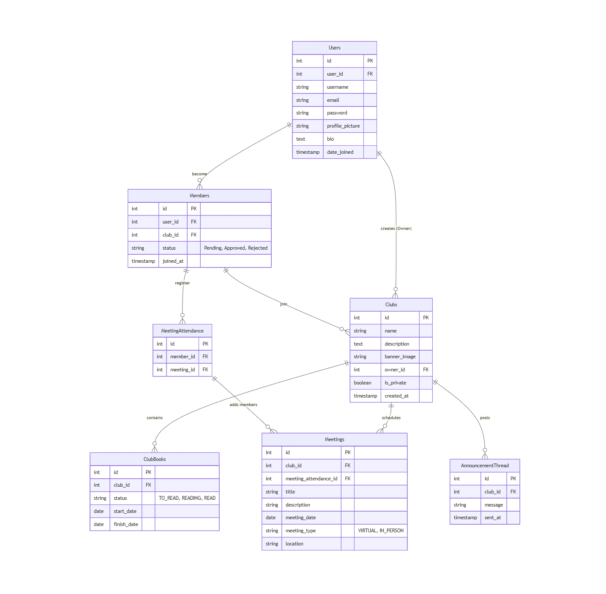
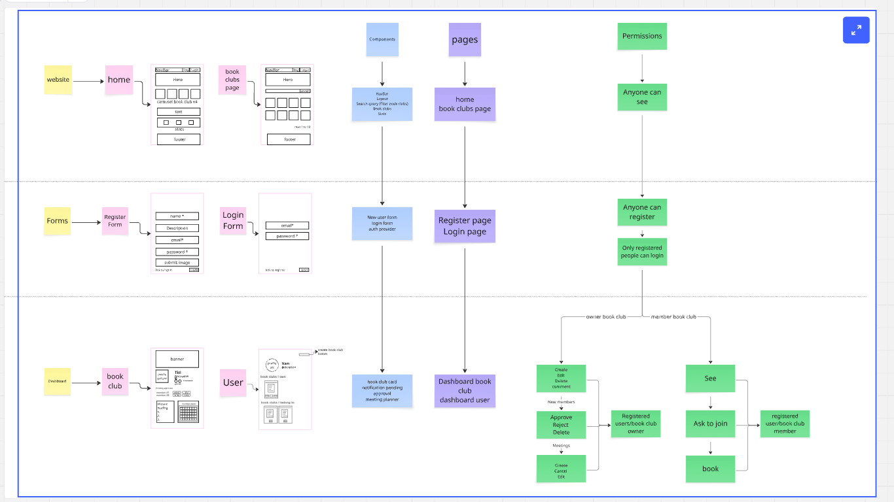

> Open Book

**A web platform for book clubs to organise, read, and grow together.**

> Built with Django REST Framework (Back-End) and React (Front-End)


## Table of Contents

- [Mission Statement](#mission-statement)
- [Target Users](#target-users)
- [Features](#features)
  - [User Roles](#user-roles)
  - [Book Clubs](#book-clubs)
  - [Books](#books)
  - [Meetings](#meetings)
  - [Announcement's board](#announcements-board)
  - [Notifications](#notifications)
  - [Pages / Endpoint Functionality](#pages--endpoint-functionality)
  - [Nice To Haves](#nice-to-haves)
- [Technical Implementation](#technical-implementation)
  - [Back-End](#back-end)
  - [Front-End](#front-end)
  - [External Integrations](#external-integrations)
  - [Git & Deployment](#git--deployment)
- [Back-End Implementation](#back-end-implementation)
  - [API Specification](#api-specification)
  - [Database Schema](#database-schema)
- [Front-End Implementation](#front-end-implementation)
  - [Wireframes](#wireframes)
  - [Branding](#branding)

---


## Mission Statement

Open Book is an all-in-one platform designed to simplify and enrich the book club experience. It replaces the scattered mix of group chats, spreadsheets, and calendar invites with a single, purpose-built space where readers can organise clubs, vote on what to read next, track their progress through a book, hold meaningful discussions chapter by chapter, and schedule meetings with integrated RSVP.

Whether it's a small group of friends or a larger community of readers, Open Book gives both organisers and members the tools to keep their book club active, structured, and engaging; without the usual coordination headaches. 

#### Currently in MVP stage 

## Target Users

Open Book serves two primary user groups:

**Book Club Owners** are the people who take the initiative to bring readers together. They need tools to create and manage clubs, schedule meetings, open voting rounds, set reading milestones, and moderate discussions. Open Book gives them a centralised dashboard to handle all of this without juggling multiple apps.

**Book Club Members** are readers who want to participate without friction. They want to join clubs easily, vote on the next book, update their reading progress, discuss chapters with fellow readers, and RSVP to meetings. Open Book makes the reading experience social and structured so members stay engaged between meetings.

## Features

Open Book allows users to create or join book clubs, suggest and vote on books, track individual and group reading progress with chapter milestones, participate in threaded chapter-by-chapter discussions, and schedule meetings with RSVP functionality. The platform supports both private (requested join) and public (open join) clubs with role-based permissions for organisers and members.

### User Roles

| Role | Access | Description |
|------|--------|-------------|
| **Owner** | Can create clubs, manage club settings, accept members, and schedule meetings. | The person who runs a specific book club. A user can be an owner in one club and a member in another. |
| **Member** | Can join clubs and RSVP to meetings. | A regular book club participant. A user can belong to multiple clubs. |

### Book Clubs

| Feature | Access | Notes / Conditions |
|---------|--------|--------------------|
| Create club | Any authenticated user | User becomes the owner of the club they create. |
| Edit club details | Owner | Name, description, genre tags, visibility. |
| Delete club | Owner | Soft delete preferred. Members are notified. |
| Set visibility | Owner | Private (Requested join) or Public (anyone can join). |
| Join club | Any authenticated user | Public clubs: instant join. Private clubs: requested join. |

### Books 

| Feature | Access | Notes / Conditions |
|---------|--------|--------------------|
| Search books | Any authenticated user | Search via Google Books API by title or author. |
| Select current book | Owner | Marks a book as the club's current read. |
| Change reading status | Owner | The owner selects the status of the book they have previously selected. |

### Meetings

| Feature | Access | Notes / Conditions |
|---------|--------|--------------------|
| Schedule meeting | Owner | Title, date/time/lenght, description, select meeting in person or virtual. |
| Edit meeting | Owner | Update details before the meeting. |
| Attending meeting | Member, Owner | Details posted on the announcement's board |
| View meetings | Member, Owner | Upcoming meeting details. |

### Announcement's board

| Feature | Access | Notes / Conditions |
|---------|--------|--------------------|
| Post comment | Owner | Write an open message, the system add the time the commment was created. |

### Notifications

| Event | Recipient | Description |
|-------|-----------|-------------|
| Accepted or Rejected members | Owner | When asked to join a private club and it is only for private bookclubs |


### Pages / Endpoint Functionality

| Page | Functionality | Notes |
|------|--------------|-------|
| Home | Marketing page with features overview, CTA to sign up, carousel with the bookclubs highlights and platform stats. | Public access. |
| Register | Create account with username, email, password. | Public access. |
| Login | Authenticate with email and password. Stores locally the JWT token. | Public access. |
| Dashboard User | Pofile picture, name, description, bookclubs I own and bookclubs I belong to. Also a CTA to create a bookclub | Authenticated. |
| Dashboard BookClub | Banner, profile pic, title, description, genre, No of members, notifications, historic reading and meeting planner | Authenticated. |
| Announcement's board | Book updates, link to virtual meeting and meeting agenda | Club members only. |
| Meetings | List upcoming meetings, book now CTA, schedule new meeting (Owner). | Club members only. |
| Create Club | Form: name, description, visibility, upload an image. | Authenticated. |
| Profile | View/edit personal info, profile picture, bio. | Authenticated. |

### Nice To Haves

- Book voting/polls.
- In-platform book rating (instead of external rating).
- Sharing book to another user (send notification).
- Multiple organizers per club (cap of 3 suggested).
- Calendar integration (e.g., Google Calendar).
- Notification system.
- Full discussion threads (beyond simple organizer note).
- Override external book ratings with platform ratings.
- Advanced member management.
- Leave club: Member | Member can leave at any time.
- Remove member: The organiser can remove a member from the club. 
- Multiple organisers: An owner can promote a member to co-organiser.

## Technical Implementation

### Back-End

- Python
- Django
- Django REST Framework
- SQL Lite
- JWT Authentication (SimpleJWT)

### Front-End

- React
- React Router
- Axios (API communication)
- React Query
- Tailwind CSS

### External Integrations

- Google Books API (book search and metadata)

### Git & Deployment

- **Back-End:** Deployed to Heroku 
- **Front-End:** Deployed to Netlify 
- **Database:** Heroku Postgres 
- **Version Control:** GitHub with feature branch workflow
- **API Testing:** Insomnia 

## Back-End Implementation

### API Specification

#### Authentication

| HTTP Method | URL | Purpose | Request Body | Success Code | Auth |
|-------------|-----|---------|--------------|:------------:|------|
| POST | `/api-token-auth/` | Sign up to app | `{"email", "username", "password"}` | 201 | None |
| POST | `/users/` | Log in to app | `{"password", "user_name"}` | 201 | Users |

#### Users

| HTTP Method | URL | Purpose | Request Body | Success Code | Auth |
|-------------|-----|---------|--------------|:------------:|------|
| GET | `/users/{id}/` | Get current user's profile | — | 200 | Users |
| POST | `/users/{id}/` | Create a profile | `{"name", "image", "meeting_type", "location", "genre"}` | 201 | Users |
| PUT | `/users/{id}/` | Update user profile | `{"name", "image", "meeting_type", "location", "genre"}` | 201 | Users |

#### Clubs

| HTTP Method | URL | Purpose | Request Body | Success Code | Auth |
|-------------|-----|---------|--------------|:------------:|------|
| GET | `/clubs/` | Retrieve a list of all book clubs | — | 200 | All |
| POST | `/clubs/` | Create a new book club | `{"name", "description", "banner_image", "created_at", "is_public", "meeting_type", "location", "status"}` | 201 | Users |
| GET | `/clubs/{id}/` | Get details of a club | — | 200 | Users |
| PUT | `/clubs/{id}/` | Update the club details | `{"name", "description", "banner_image", "created_at", "is_public", "meeting_type", "location", "status"}` | 201 | Organiser |
| PATCH | `/clubs/{id}/` | Change the club status to inactive or active | `{"status"}` | 201 | Organiser |

#### Members

| HTTP Method | URL | Purpose | Request Body | Success Code | Auth |
|-------------|-----|---------|--------------|:------------:|------|
| GET | `/clubs/{id}/members/` | Retrieve a list of members and pending members for a book club | — | 200 | Organiser |
| POST | `/clubs/{id}/members/` | Join a book club | `{"user_id", "requested_at", "status"}` | 201 | Users |
| PATCH | `/clubs/{id}/members/{id}/` | Respond to a membership request (Accept / Decline) | `{"status"}` | 201 | Organiser |

#### Club Books

| HTTP Method | URL | Purpose | Request Body | Success Code | Auth |
|-------------|-----|---------|--------------|:------------:|------|
| GET | `/clubs/{id}/clubbooks/` | Display club book history | — | 200 | Club members |
| POST | `/clubs/{id}/clubbooks/` | Upload a book to the club (retrieve from Google Books) | `{"name", "description", "cover_image", "book_url", "status"}` | 201 | Organiser |
| PATCH | `/clubs/{id}/clubbooks/{id}/` | Change club book status (to read, reading, read) | `{"status"}` | 201 | Organiser |

#### Meetings

| HTTP Method | URL | Purpose | Request Body | Success Code | Auth |
|-------------|-----|---------|--------------|:------------:|------|
| POST | `/clubs/{id}/meetings/` | Schedule a meeting | `{"title", "description", "date-time", "duration", "meeting_type", "location"}` | 201 | Organiser |
| PUT | `/clubs/{id}/meetings/{id}/` | Update meeting details | `{"title", "description", "date-time", "duration", "meeting_type", "location"}` | 201 | Organiser |
| POST | `/clubs/{id}/meetings/{id}/` | Register to join a meeting | `{"member_id", "registered_at"}` | 201 | Members |

#### Announcements

| HTTP Method | URL | Purpose | Request Body | Success Code | Auth |
|-------------|-----|---------|--------------|:------------:|------|
| GET | `/clubs/{id}/announcements/` | List all announcements for the club | — | 200 | Club members |
| POST | `/clubs/{id}/announcements/` | Create a new announcement | `{"message", "created_at"}` | 201 | Organiser |


### Database Schema

#### Schema: 





## Front-end Implementation

### Branding

#### Fonts

| Role | Font | Style |
|------|------|-------|
| Headings | [Lora](https://fonts.google.com/specimen/Lora) | Elegant serif with calligraphic roots. Literary and trustworthy. |
| Body | [Nunito Sans](https://fonts.google.com/specimen/Nunito+Sans) | Clean, rounded sans-serif. Friendly and easy to read. |

```css
@import url('https://fonts.googleapis.com/css2?family=Lora:ital,wght@0,400;0,500;0,600;0,700;1,400&family=Nunito+Sans:wght@300;400;500;600;700&display=swap');

font-family: 'Lora', serif;              /* Headings */
font-family: 'Nunito Sans', sans-serif;   /* Body */
```

#### Colours

**Primary**

| Name | Hex | Preview | Usage |
|------|-----|---------|-------|
| Terracotta | `#C9624A` | 🟧 | Buttons, links, active states |
| Terracotta Light | `#FBF0EC` | 🟨 | Hover states, tags, soft backgrounds |

**Secondary**

| Name | Hex | Preview | Usage |
|------|-----|---------|-------|
| Teal | `#5A8F8B` | 🟩 | Success states, progress indicators |
| Teal Light | `#EBF4F3` | ⬜ | Status badges, secondary backgrounds |


### Wireframes


